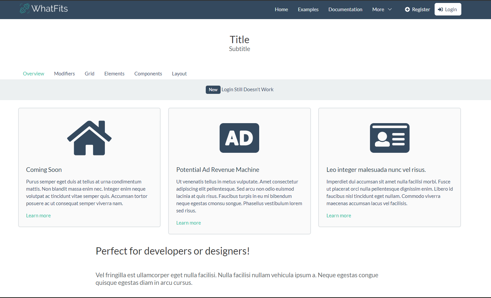

# WhatFits Web Application

A fitness social media web application. It helps like minded individuals to connect based on interest concerning physical activities.

## Get Started

Follow the README.md on the server and client folder for instructions for each.

* client
  * This directory contains a Vue project for the client side of the project.

* server
  * This directory constains a Web API project used for the server side of this project.

## Release History

* 0.0.1
    * Base deployment of Homepage, Registration, Login, and UserProfile
* 1.0.0
    * All features are deployed.

## Built With

* [Visual Studio Community 2017](https://www.visualstudio.com/downloads/) - used for backend development
* [Visual Studio Code](https://code.visualstudio.com/) - Used for frontend development

## Frameworks

* [Vue.js](https://vuejs.org/) - Frontend JavaScript framework used
* [Bulma](https://bulma.io/) - Frontend CSS framework used
* [ASP.NET 4.6.1](https://www.microsoft.com/en-us/download/details.aspx?id=49981) - Backend Framework used

## Contributing

1. Not accepting anyone at the moment

## Authors

* **Aaron Pham** - *Initial work* - [apham42](https://github.com/apham42)
* **Abram Villanueva** - *Initial work* - [apvillan](https://github.com/apvillan)
* **George Cheng** - *Initial work* - [George17688](https://github.com/George17688)
* **Longcheng Chi** - *Initial work* - [DPmax](https://github.com/DPmax)
* **Roberto Sanchez** - *Initial work* - [Zyxel-1](https://github.com/Zyxel-1)

See also the list of [contributors](https://github.com/apham42/WhatFits/graphs/contributors) who participated in this project.

## License

This project is licensed under the MIT License - see the [LICENSE.md](LICENSE.md) file for details

## Acknowledgments
* To be included by first deployment

